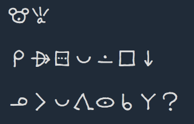
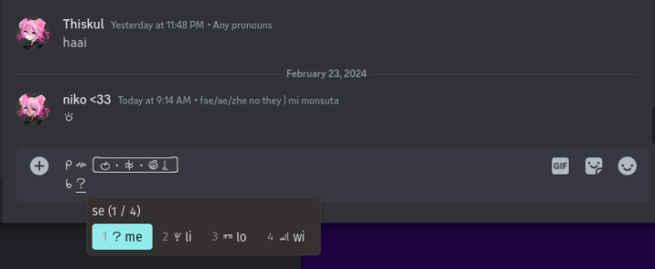

# sitelen pona UCSUR guide!!!

o sitelen e sitelen pona lon ilo mute a!

## Render sitelen pona on most desktop applications!

Due to the standardization of codepoints in the UCSUR, you can now render sitelen pona on many desktop applications (Firefox, Discord, etc). In many applications all you need to do is install a UCSUR compatible sitelen pona font, and you are good to go. However there are some quirks, and you need an input engine to be able to easily input these characters, which is the purpose of this guide.

# Fonts

The current recomended fonts for sitelen pona are:

- [Fairfax HD](https://www.kreativekorp.com/software/fonts/fairfaxhd.shtml)

  
  
  This font supports the latest (2024-02-20) version of UCSUR. It *does not* look a bit nasa, however it is mostly readable.

- [nasin nanpa](https://github.com/ETBCOR/nasin-nanpa)

  
  
  This is an alternative font, actively being developed by jan Itan (`@etbcor`). It is monospace, and supports cartouches, combination glyphs, and long glyphs (pi, tawa & lon). This font supports the 2024-02-20 version of UCSUR, and is used in [*su*](https://www.amazon.com/dp/0978292375)!.

- [sitelen seli kiwen juniko (mono)](https://www.kreativekorp.com/software/fonts/sitelenselikiwen)
    
  
    
  This font by jan Lepeka supports the most recent version of UCSUR (2024-02-20). It's personally my favorite! There are proportional *(glyphs take up varying amounts of space)* and monospaced *(glyphs take up the same amount of space)* versions of the font. Monospaced fonts in general are recommened for sitelen pona (both of the above fonts are monospaced). **sitelen seli kiwen juniko mono**, the monospaced version of sitelen seli kiwen juniko is used in the css below, fyi.

If you are unsure of which font to pick, I would recommend nasin nanpa.

Once you have installed any of these fonts you are done, in many applications sitelen pona should render correctly, with the exception of websites, as they do not fall back to sitelen pona. This is an issue, because some applications are actually websites, with a notable example being Discord. 

## Discord

Because internally the Discord application relies on Electron, it does not fall back to the font you installed when sitelen pona glyphs are present, instead displaying these frustrating little squares. To fix this, one option is to install a fake *Helvetica Neue* font, which will allow sitelen pona to render wherever Helvetica Neue is used, which includes Discord!

Another option is to modify your Discord. Currently, this modification is possible on all Desktop systems. **This option is dangerous, violates Discord TOS, and may result in your account being banned.**

### Font

Simply install the fake Helvetica Neue font, and it should result in Discord displaying UCSUR.

**For Windows,**

- Download and install [this font](./nasin-nanpa-patched.otf)

**For Linux,**

- Cownload the above font
- Copy the file to `~/.local/share/fonts/`

This method does not work on macOS or mobile devices. 

### Desktop

**⚠️⚠️⚠️ THIS VIOLATES DISCORD'S TOS. O SONA A ⚠️⚠️⚠️**

To patch your Discord to correctly render sitelen pona on desktop, we will use the [Vencord client modification](https://vencord.dev/). Start by following the installation guide on their website to install it. After installing Vencord we need to add a CSS snippet, this is a small snippet of code that tells Vencord to use Fairfax HD or nasin nanpa when sitelen pona is present.

First go to go to Settings, then scroll down to "Vencord", click "Themes", and press "Edit QuickCSS"

Paste the [sitelen-pona.css](https://raw.githubusercontent.com/neroist/sitelen-pona-ucsur-guide/main/css/sitelen-pona.css) file into the text box (click the link, then press <kbd>Ctrl</kbd> + <kbd>A</kbd> then <kbd>Ctrl</kbd> + <kbd>C</kbd>. Then, paste the text into the text box.) Remember to remove the `@-moz-document domain("discord.com") {` line from the code!

Once you have pasted the code into the QuickCSS box, you can now exit settings, your Discord should be properly set up to render sitelen pona!

### Browser

<!-- If you use a web browser, you can use the [stylus extension](https://github.com/openstyles/stylus#releases) to add the css code above. Simply click on the extension with a discord tab open, and use the "Write new style as UserCSS" option. Be sure to write it for just "discord.com", as choosing a different URL will make it not work outside of the channel you were looking at. -->

If you use a web browser, you can use the [stylus extension](https://github.com/openstyles/stylus#releases) to help render sitelen pona. 

Simply install [this userstyle](https://userstyles.world/style/14920/sitelen-pona-o-lon-lipu-siko-a) and you're done!

### Android

> I do not own an Android phone, so I cannot give an accurate guide on this section (maybe somebody fill this in with a pull request), however kulupu Mimuki (`@.mouseless`) has put together an [excellent video guide](https://cdn.discordapp.com/attachments/882652782509846548/943688987070062612/YouCut_20220217_121644150.mp4) for achieving this with [Aliucord](https://github.com/Aliucord/Aliucord).

*\~ the previous text here, tan jan Lili*

There used to be a video guide for viewing sitelen pona in [Aliucord](https://github.com/Aliucord/Aliucord) by kulupu Mimuki. However, the video link is now dead, nor have I been able to get sitelen pona working in Aliucord. But [this reddit post](https://www.reddit.com/r/tokipona/comments/10bwbur/guide_on_viewing_and_rendering_sitelen_pona_on/) is a wonderful guide on how to get UCSUR sitelen pona on Android. Regarding viewing sitelen pona, here are the listed steps:

Installing the font:

1. Download [nasin-nanpa-2.5.1.otf](https://github.com/ETBCOR/nasin-nanpa/releases/download/n2.5.1/nasin-nanpa-2.5.1.otf). (Please note that the latest version will not work; the latest version of nasin nanpa now translations Latin characters as well as UCSUR, which messes things up).

2. Convert nasin-nanpa-2.5.1.otf to [nasin-nanpa-2.5.1.ttf](https://www.mediafire.com/file/pj5nmp2io9y34qt/nasin-nanpa-2.5.1.ttf/file) (If you're not sure how, skip this step or click the link).

3. Download [zFont 3](https://play.google.com/store/apps/details?id=com.htetznaing.zfont2&gl=US) from the Play Store. *(Other font changing apps such as [#mono_](https://xdaforums.com/t/app-mono_-flipfont-custom-ttf-installer-v2-1-for-samsung-oneui-1-2-3-no-root.4195613/) might work instead)*

4. In the app, go to Downloads, press the + icon in the bottom right and add the font file (select "Add File"). (If you didn't convert it, the app will prompt you to install another app and you can do it there if you need).

5. Click on the font file and press Apply.

6. The app will ask you for your Android version, choose "Auto".

7. Follow the steps in the app, they vary depending on your phone, for me it involved installing a fake Samsung font.

8. Once you're done you should now be able view sitelen pona in every app.

> You should be able to read this: 󱥞󱤘󱤮󱤉󱥁

<!-- TODO: Add how this changes the OS's font & how to change it back to default, if possible -->

<!-- TODO: iOS? -->

## Input

Now that sitelen pona is rendering properly, we need to be able to type it!

### Windows

There are two input methods for Windows: nasin Ajemi and nasin AHK

You can download & install nasin Ajemi from [this link](https://github.com/dec32/Ajemi/releases/latest), see the [README](https://github.com/dec32/Ajemi) on how to use it. 

For nasin AHK, there is an [Auto Hotkey Script](https://raw.githubusercontent.com/ETBCOR/nasin-nanpa/main/ahk-script/sitelen-pona-4.0.ahk) (download with <kbd>Ctrl</kbd>+<kbd>S</kbd>) by jan Itan (`@etbcor`) for input. Write the toki pona word and then a \` (the letter under escape) to convert it into sitelen pona. You can also write `` [` `` and `` ]` `` for cartouches, as well as `` (` `` and `` )` `` for long glyphs. There is also a ["small" version of the script](https://raw.githubusercontent.com/ETBCOR/nasin-nanpa/main/ahk-script/stl-pon-4.0.ahk) that uses 3 letter codes for each word instead of typing the whole word.

For this of this to work, you need to have [Auto Hotkey](https://www.autohotkey.com/) installed.

Other features of the script are explained near the bottom of [nasin-nanpa's releases page](https://github.com/ETBCOR/nasin-nanpa/releases/tag/n2.5.1).

### macOS

jan Tepo (`@tbodt`) has made an [input plugin for macOS](https://raw.githubusercontent.com/neroist/sitelen-pona-ucsur-guide/main/sitelen-pona.inputplugin) with modifications by jan Semu (`@jmiibo`) to support UCSUR (download with <kbd>Ctrl</kbd>+<kbd>S</kbd>). Download it, then install it by double clicking. Then enable it in `System Preferences` -> `Keyboard` -> `Input Sources`. You'll find it listed under "Chinese, Simplified".

### Linux

<!-- TODO: Test this... tenpo lon la mi kepeken ilo sama tawa sitelen · taso ilo ibus ala -->

The ~~only~~ (nasin sitelen Wakalito li lon · ilo ante kin li lon) current supported input engine for Linux is ibus, for this to work, you need both `ibus`, and `ibus-tables` installed. For installation commands/instructions, see [this page](https://github.com/ibus/ibus/wiki/ReadMe#install-binary-packages).

> During installation, regarding Ubuntu, feel free to remove `ibus-qt4` from the `apt-get insall` command, which has been removed from Ubuntu's main repository.

jan Komi (`@cominixo`) has created an [ibus input table](https://raw.githubusercontent.com/neroist/sitelen-pona-ucsur-guide/main/tokipona.txt) *(click the link & download with <kbd>Ctrl</kbd>+<kbd>S</kbd>)*. Copy it to a directory of your choice, and then open a terminal in the same directory. Run these commands to install it:

```bash
sudo ibus-table-createdb -n /usr/share/ibus-table/tables/tokipona.db -s tokipona.txt
ibus-daemon -drxR
```



Once you have done this, open the ibus preferences (you can do this with the `ibus-setup` command). Go to `Input Method`, click `Add` and then select `sitelen pona` (the last option under the English category).

Finally, if necessary, go to your keyboard settings in your settings application and add a "sitelen pona" input source (the name should be "English (sitelen pona)").

This should result in a new tray icon which indicates which input source you're using — English or sitelen pona. Which keybinding which allows you to switch input sources may depend on your distro. However, on Pop!_OS it is <kbd>Super</kbd> + <kbd>Space</kbd>

<details>
<summary>
  <b>List format for instructions</b>
</summary>

1. Install `ibus` and `ibus-tables`. Follow the instructions on [this page](https://github.com/ibus/ibus/wiki/ReadMe#install-binary-packages).

    - For Ubuntu, do not install the `ibus-qt4` package

2. Download the ibus input table [here](https://raw.githubusercontent.com/neroist/sitelen-pona-ucsur-guide/main/tokipona.txt).

3. Copy the file to a chosen directory and open a terminal in the directory

4. Run these two commands:

```bash
sudo ibus-table-createdb -n /usr/share/ibus-table/tables/tokipona.db -s tokipona.txt
```

```bash
ibus-daemon -drxR
```

5. Open ibus preferences (you may run the `ibus-setup` command)

6. Add the sitelen pona input method. Go to `Input Methods` -> `Add` -> `English` -> *(scroll all the way down to)* `sitelen pona`

7. If needed, go to your settings application and add a new input source of the name "English (sitelen pona)" 

    - Feel free to search for "sitelen pona" and select anything similar, if "English (sitelen pona)" is not present

8. Switch input sources (either via keybindings or the tray icon).

9. pini a!

</details>

### Espanso / nasin sitelen Wakalito

<!-- > I reccommend the above methods more than this one. -->

*nasin Wakalito* is an input method for writing Toki pona words. It is available on macOS, Linux, and Windows using [Espanso](https://espanso.org/). By default, nasin Wakalito outputs words in sitelen Lasina. However, by using a modified config file, we can output UCSUR instead.

In addition, if you just need/want to use Espanso and don't like the triggers in nasin Wakalito, there is also a config file for that ([`sitelen-pona-espanso.yml`](./sitelen-pona-espanso.yml)).

nasin:

1. Install Espanso [here](https://espanso.org/install/)

2. Download a config file. There are two:

    - [This file](https://raw.githubusercontent.com/neroist/sitelen-pona-ucsur-guide/main/wakalito-7-3-2-ucsur.yml) uses nasin Wakalito's triggers, and outputs UCSUR

    - [This file](https://raw.githubusercontent.com/neroist/sitelen-pona-ucsur-guide/main/sitelen-pona-espanso.yml) uses toki pona word triggers with `\` as en ending character (e.g. `meli\`, `kala\`), and outputs UCSUR

3. Copy or move the file to Espanso packages folder

	  - Windows: `C:\Users\<user>\AppData\Roaming\espanso\match\packages`
        - (<kbd>Win</kbd>+<kbd>R</kbd>, type `%appdata%` to get to `\Roaming`)
	
    - macOS: `/Users/<user>/Library/Preferences/espanso/match/packages`
	
    - Linux: `/home/<user>/.config/espanso/match/packages`

4. Start Espanso

5. Start writing!

    - A table for triggers -> words can be found on sona.pona.la, [here](https://sona.pona.la/wiki/Wakalito), with a few modifications listed below. This is for the first config file, `wakalito-7-3-2-ucsur.yml`.

#### Modifications

| Character                                  | Keys on a QWERTY layout |
| -------------------------------------------| ----------------------- |
| `　` (fullwidth space)                     | `666`, `   ` (3 spaces) |
| `‍` ("-" zero width joiner)                 | `aa`                    |
| `󱦕` ("^" stacking joiner)                  | `gg`                    |
| `󱦖` ("*" scaling joiner)                   | `hh`                    |
| `󱦝` (":" sp colon)                         | `6y`                    |
| `󱦜` ("·" sp dot)                           | `3`                     |
| `󱦐` ("[" cartouche start)                  | `c1`                    |
| `󱦑` ("]" cartouche end)                    | `c2`                    |
| `「` (cjk start quote)                      | `q1`                    |
| `」` (cjk end quote)                        | `q2`                    |
| `󱦗` ("(" start left-combining long glyph)  | `b1`                    |
| `󱦘` (")" end left-combining long glyph)    | `b2`                    |
| `󱦚` ("{" start right-combining long glyph) | `d1`                    |
| `󱦛` ("}" end left-combining long glyph)    | `d2`                    |

### Android

Two input engines for android exist:

- [jan Komi's (`@cominixo`)](https://github.com/cominixo/tokiponakeyboard/releases/tag/v0.1-sp) (similar Y better APKs can be found in [this reddit post](https://www.reddit.com/r/tokipona/comments/10bwbur/guide_on_viewing_and_rendering_sitelen_pona_on/))
 
    - When trying to install the APK, if you get an error that you cannot due to "package conflicts," delete the other Toki Pona Keyboard app and try again.

- and [kulupu Mimuki's (`@.mouseless`)](./android_keyboard.zip) which can be used with [this app](https://play.google.com/store/apps/details?id=de.humbergsoftware.keyboarddesigner), but it requires a paid addon to import the file.

<!-- TODO: iOS? -->

### Web

If you are on a device which cannot use these input methods for any reason, [jan Tala (`@at`)](https://github.com/DataKinds) has created a [web based converter](https://ilo-pi-sitelen-pona.glitch.me/) from sitelen Lasina to sitelen pona.

# End

> This is a really huge step for toki pona, and I am extremely happy to see this happen. If you have created a font, input method, or any other resource that you want added, please create a pull request, issue, or just ping me on discord `@o.v` (jan Lili lon ma pona pi toki pona) and we can talk!

*~ tan jan Lili*

## ijo pona

thank you to

- jan Komi
- kulupu Mimuki
- jan Tala
- soweli pona Tesa
- mun Kekan San
- jan Tepo
- jan Itan
- jan Lili
- jan Semu
- ijo `@Qwerty-Space` (lon lipu github)
- ijo `@ReveredOxygen`
- kulupu katu

sina ale li pona wawa a li pana sona e pona anu pali pona a (anu ni tu a a)

